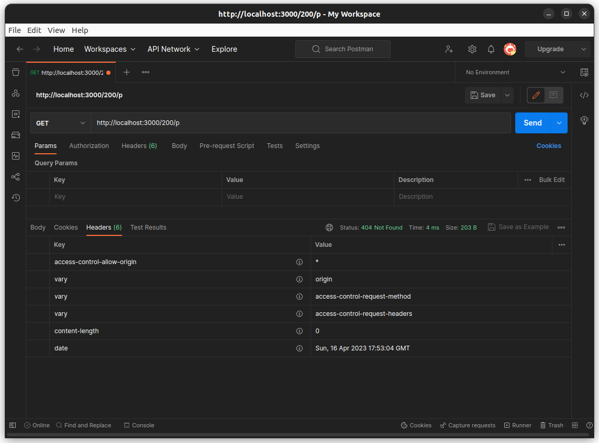
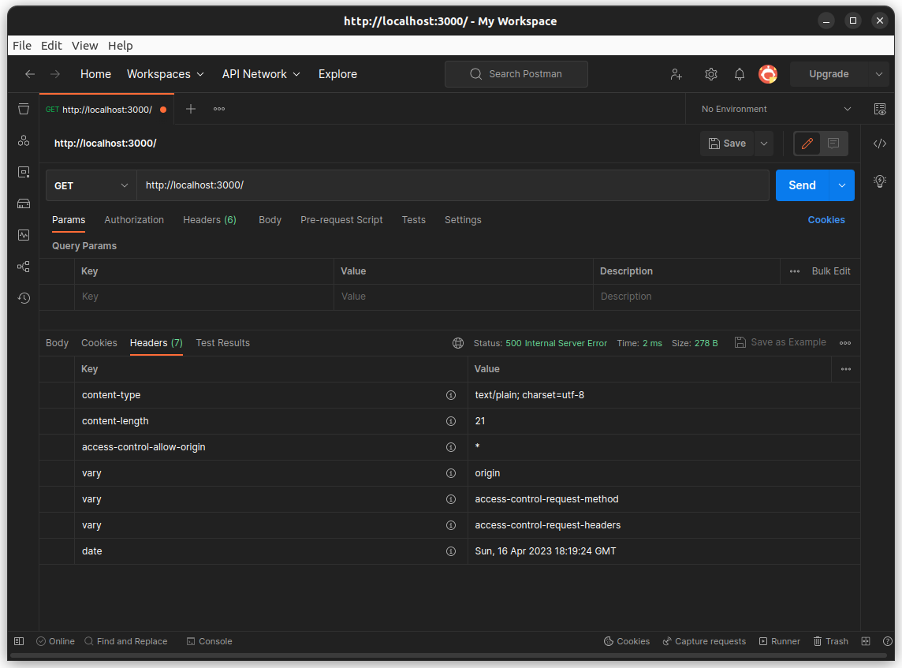

# Testing CORS responses for Axum

Summary: CORS is properly returned even when the response is `Err(...)`
(from a handler).

## Testing A

Testing (no middleware failure):
1. Build the application.
2. Run the application. `cargo run`
3. Visit `/200` (will return 200 OK) and check CORS headers. Must exist.
4. Visit `/500` (will return 500) and check.
5. Visit `/404` (will return 404) and check.
6. Visit unhandled routes (any other path, like `/200/3`) and check.

Expectation:
* For each request above, `Access-Control-Allow-Origin` should be all
set. At the point of writing, it is always `*` (any origin).

The screenshot above shows the `access-control-allow-origin: *`
HTTP header being set when an unhandled route is requested
(seen by the response `404 Not Found`).

## Testing B

Testing (middleware failure):
1. Run testing (no middleware failure).
2. Set environment variable `PREBREAK=1`. Run testing (no mid fail).
3. Unset `PREBREAK`. Set `POSTBREAK=1`. Run testing (no mid fail).
5. Check that in both cases, you observe the ACAO header set.

The screenshot above shows the header still being set even though
a failure was injected at the middleware layer.
